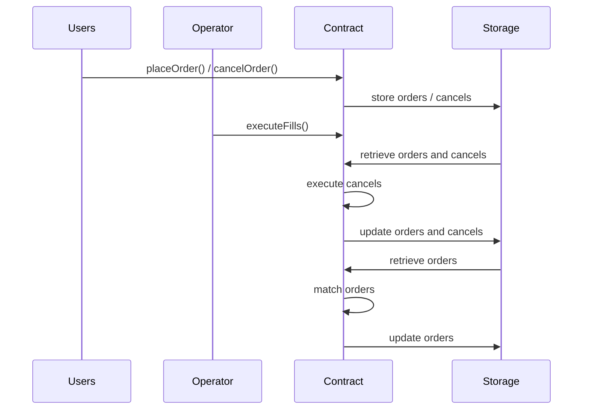

# Suave-FBA-DEX

Proof of concept for a Frequent Batch Auction on Suave.

## Dependencies
1. <a href=https://book.getfoundry.sh/getting-started/installation>Foundry</a>

2. <a href=https://github.com/flashbots/suave-geth>Suave</a>


## Usage

### Build

```shell
$ forge build
```

### Test

Use the ffi flag with Forge.
You should have a Suave node running on your local machine.

```shell
$ forge test --ffi
```

### Format

```shell
$ forge fmt
```

### Read the Docs

```shell
$ forge doc --serve --port 4000
```

## Overview
### Overview of the FBA Process

The FBA process revolves around three main functions:

1. **`placeOrder`**: Allows users to place orders in the order book.
2. **`cancelOrder`**: Enables users to cancel their previously placed orders.
3. **`executeFills`**: Executed by the operator at regular intervals to match and fulfill orders.

### Key Roles and Interaction Diagram

We can illustrate the interaction between the main participants

- Users: the users who place and cancel orders
- Operator: the entity responsible for executing fills
- Contract: the smart contract that manages the order book and fills
- Storage: Confidential Data Store that stores orders and the contract storage that stores cancels


